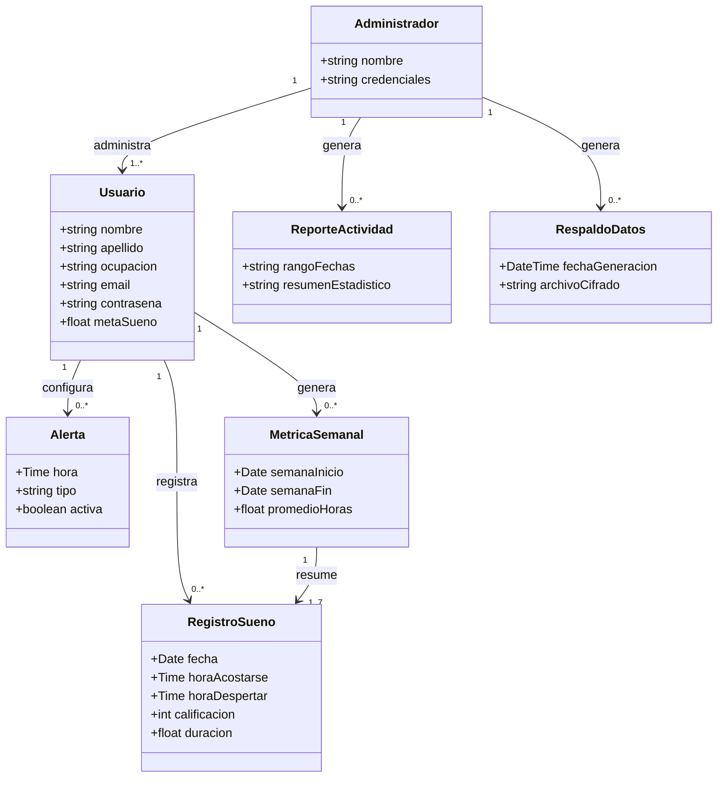
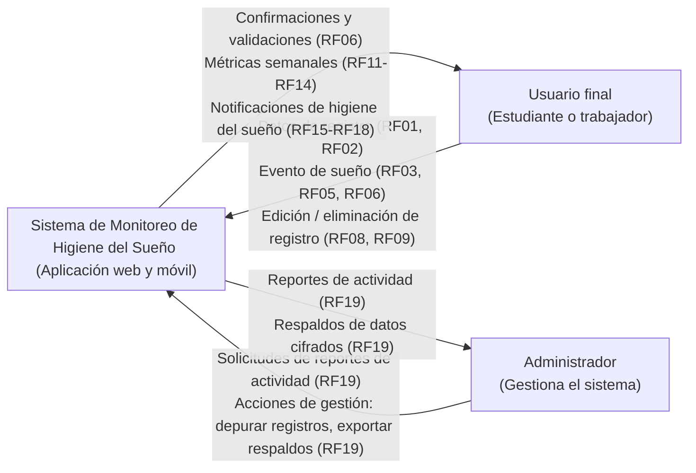
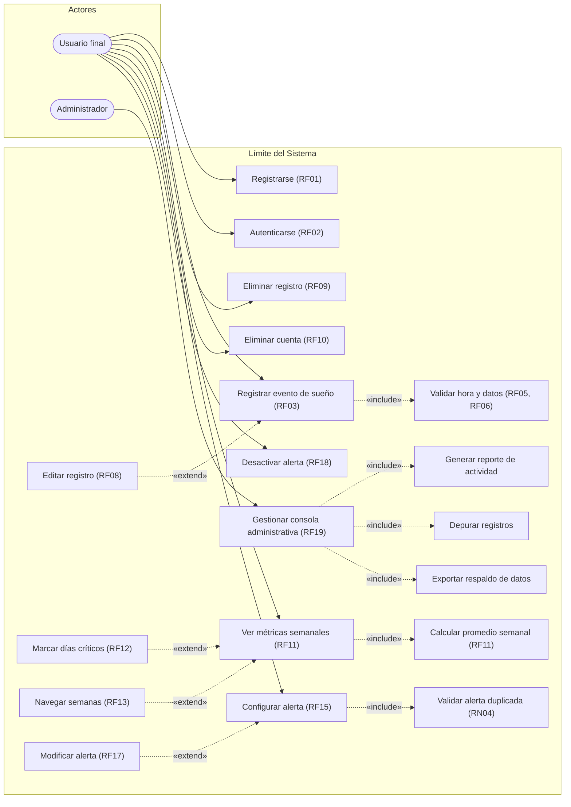
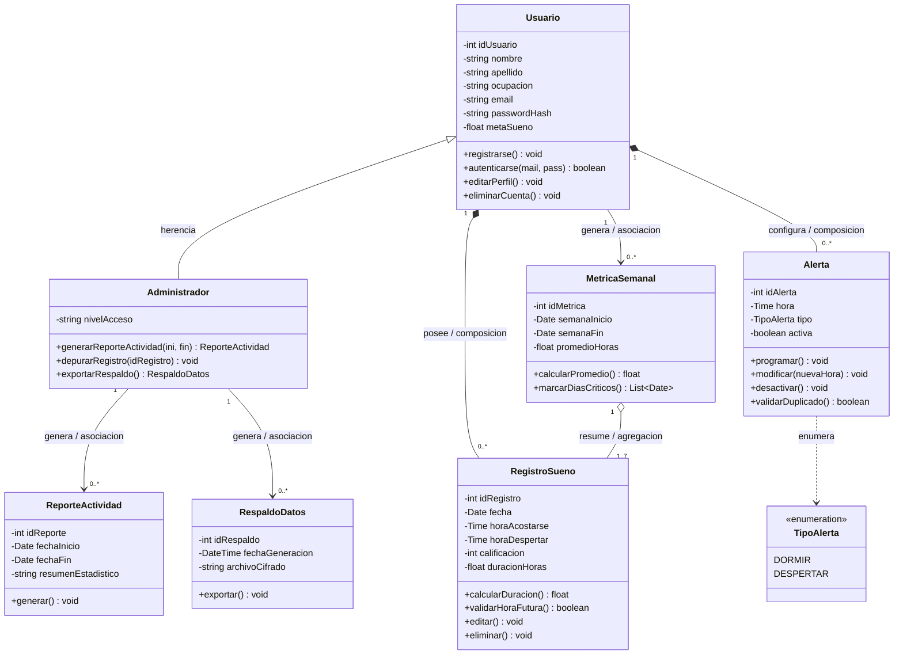

# Informe #3 - Sistema de Monitoreo de Higiene del Sueño

**Integrantes:**
- Andres Felipe Lenis Cholo
- Juan Pablo Deossa Yepes

---

## 1. Diagrama de Dominio

### Representación del Modelo de Dominio

### Descripción de Clases del Dominio

| Clase | Descripción | Origen |
| :--- | :--- | :--- |
| **Usuario** | Estudiante o trabajador que registra sus hábitos de sueño | RF01, RF02 |
| **Registro Sueño** | Evento diario de sueño: hora de acostarse, despertar, calificación | RF03–RF09 |
| **Alerta** | Recordatorio programable de higiene del sueño | RF15–RF18, RN04 |
| **Métrica Semanal** | Resumen semanal de horas dormidas y días críticos | RF11–RF14, RN03 |
| **Administrador** | Usuario con rol de gestión y monitoreo del sistema | RF19 |
| **Reporte Actividad** | Reporte generado por el administrador por rango de fechas | RF19 |
| **Respaldo Datos** | Exportación cifrada de la información del sistema | RF19 |

---

## 2. Diagrama de Contexto

El sistema se representa como una caja central que interactúa con dos actores externos:

### Interacciones de Contexto

- **Usuario final:** Envía sus registros de sueño y configuraciones de alertas; recibe métricas semanales y notificaciones de higiene del sueño.
- **Administrador:** Envía solicitudes de reportes y acciones de gestión; recibe estadísticas de uso y respaldos de datos del sistema.

---

## 3. Diagrama de Casos de Uso

Detalla las interacciones de los dos actores con el sistema.

### Relaciones
- **«include»**: Representa comportamiento obligatorio y reutilizable.
- **«extend»**: Comportamiento opcional que amplía un caso de uso base solo bajo ciertas condiciones (editar un registro existente, marcar días críticos, navegar semanas anteriores, modificar una alerta).

### Estructura de Casos de Uso

### Tabla de Relaciones de Casos de Uso

| Tipo | Caso de uso base | Caso relacionado | Justificación |
| :--- | :--- | :--- | :--- |
| **«include»** | Registrar evento de sueño | Validar hora y datos | RF05, RF06 validación obligatoria en cada registro |
| **«include»** | Ver métricas semanales | Calcular promedio semanal | RF11 cálculo necesario cada vez que se consulta |
| **«include»** | Configurar alerta | Validar alerta duplicada | RN04 regla de negocio obligatoria |
| **«extend»** | Registrar evento de sueño | Editar registro (RF08) | Solo se activa si ya existe un registro ese día (RN01) |
| **«extend»** | Ver métricas semanales | Marcar días críticos (RF12) | Condicional a que existan días bajo la meta/umbral (RN03) |
| **«extend»** | Ver métricas semanales | Navegar semanas (RF13) | Opcional, a solicitud del usuario |
| **«extend»** | Configurar alerta | Modificar alerta (RF17) | Solo aplica sobre una alerta ya existente |

---

## 4. Diagrama de Clases

### Representación UML de Clases

### Relaciones del Diagrama de Clases

| Relación | Tipo | Cardinalidad | Significado |
| :--- | :--- | :--- | :--- |
| **Administrador → Usuario** | Herencia | — | Administrador es una especialización de Usuario, hereda sus atributos y operaciones básicas |
| **Usuario — RegistroSueño** | Composición | 1 — 0..* | Los registros de sueño no existen sin el usuario que los posee; se eliminan junto con la cuenta (RF10) |
| **Usuario — Alerta** | Composición | 1 — 0..* | Las alertas dependen exclusivamente del usuario que las configuró |
| **Usuario — MétricaSemanal** | Asociación | 1 — 0..* | Cada usuario genera sus propias métricas semanales calculadas |
| **MétricaSemanal — RegistroSueño** | Agregación | 1 — 1..7 | Una métrica resume varios registros, pero éstos existen independientemente de la métrica |
| **Administrador — ReporteActividad** | Asociación | 1 — 0..* | Un administrador puede generar múltiples reportes de actividad |
| **Administrador — RespaldoDatos** | Asociación | 1 — 0..* | Un administrador puede generar múltiples respaldos de datos cifrados |

---

## 5. Requisitos Funcionales (RF)

| ID | Requisito |
| :--- | :--- |
| **RF01** | El sistema debe permitir a los usuarios registrarse creando un perfil (nombre, apellido, ocupación, meta de sueño, credenciales). |
| **RF02** | El sistema debe permitir la autenticación de usuarios mediante correo electrónico y contraseña. |
| **RF03** | El sistema debe permitir registrar un evento de sueño diario, indicando hora de acostarse, hora de despertar, fecha y calificación del descanso (escala 1-5). |
| **RF04** | El sistema debe calcular automáticamente la duración total del sueño a partir de la hora de inicio y la hora final, incluyendo los casos donde el sueño cruza la medianoche. |
| **RF05** | El sistema debe validar la hora de inicio de sueño ingresada por el usuario, aplicando la restricción definida en RN02. |
| **RF06** | El sistema debe rechazar registros con campos obligatorios vacíos o formato de hora inválido, informando al usuario el error específico. |
| **RF08** | El sistema debe permitir al usuario editar el registro de sueño ya existente para la fecha actual en lugar de crear un duplicado, cuando intente registrar un segundo evento el mismo día, en cumplimiento de RN01. |
| **RF09** | El sistema debe permitir a los usuarios eliminar sus propios registros de sueño. |
| **RF10** | El sistema debe permitir a los usuarios eliminar su propia cuenta, junto con todos los datos asociados. |
| **RF11** | El sistema debe calcular y mostrar un resumen semanal de horas dormidas por día, junto con el promedio semanal. |
| **RF12** | El sistema debe marcar visualmente como días críticos aquellos días que cumplan la condición definida en RN03. |
| **RF13** | El sistema debe permitir navegar entre semanas anteriores para consultar el historial de métricas. |
| **RF14** | El sistema debe informar al usuario cuando no existan datos suficientes para generar las métricas semanales. |
| **RF15** | El sistema debe permitir configurar alertas de higiene del sueño, especificando una hora y un tipo (dormir/despertar). |
| **RF16** | El sistema debe validar la configuración de una alerta nueva, aplicando la restricción definida en RN04. |
| **RF17** | El sistema debe permitir modificar la hora de una alerta existente. |
| **RF18** | El sistema debe permitir desactivar una alerta sin eliminar su registro histórico. |
| **RF19** | El sistema debe proporcionar una consola administrativa con reportes de actividad, depuración de registros y exportación de respaldos de datos. |

---

## 6. Reglas de Negocio (RN)

| ID | Regla |
| :--- | :--- |
| **RN01** | Solo se permite un registro de sueño por usuario por fecha. |
| **RN02** | No se puede registrar una hora de inicio de sueño que corresponda a una fecha/hora futura. |
| **RN03** | Un día se considera crítico cuando las horas dormidas registradas son inferiores a la meta de sueño personal definida por el usuario en su perfil (RF01); si el usuario no ha definido una meta, se aplica un umbral por defecto de 6 horas. |
| **RN04** | No se permite la creación de alertas duplicadas (misma hora y mismo tipo) para un mismo usuario. |

---

## 7. Requisitos No Funcionales (RNF)

| ID | Categoría | Requisito |
| :--- | :--- | :--- |
| **RNF01** | Seguridad | Las contraseñas de los usuarios deben almacenarse cifradas mediante un algoritmo cifrado seguro. |
| **RNF02** | Seguridad | El acceso a los endpoints que gestionan datos personales debe requerir autenticación mediante una sesión con expiración. |
| **RNF03** | Disponibilidad | El backend debe estar desplegado, accesible desde cualquier lugar y en cualquier momento. |
| **RNF04** | Persistencia | Los datos deben almacenarse en una base de datos relacional, para garantizar integridad y sincronización entre dispositivos. |
| **RNF05** | Usabilidad | El registro de un evento de sueño debe requerir el menor número de interacciones posible. |
| **RNF06** | Monitoreo | Los errores no controlados en producción deben registrarse. |
| **RNF07** | Mantenibilidad | El código debe organizarse por rutas/endpoints, permitiendo agregar funcionalidades sin afectar las existentes. |
| **RNF08** | Rendimiento | El cálculo de métricas semanales no debe degradar el rendimiento del sistema para otros usuarios conforme crece el volumen de datos. |
| **RNF09** | Compatibilidad | La aplicación debe funcionar en versiones recientes de Android e iOS, y en navegadores web modernos. |

---

## 8. Historias de Usuario

| ID | Historia de usuario |
| :--- | :--- |
| **HU1** | Registro de inicio de sueño |
| **HU2** | Visualización de métricas semanales |
| **HU3** | Programación de recordatorios de higiene de sueño |
| **HU4** | Gestión y monitoreo del sistema |

---

## 9. Casos de Uso Narrativos, Escenarios y Pruebas por HU

### HU1: Registro de inicio de sueño

**Actor:** Usuario final  
**Precondición:** El usuario tiene la aplicación instalada, abierta y con sesión activa.  
**Flujo principal:** El usuario navega a la pantalla de registro de sueño, selecciona la hora en que se acostó, califica cómo se siente al despertar en una escala del 1 al 5, presiona "Guardar"; el sistema valida que los datos estén completos y en formato correcto, y confirma el registro.  
**Flujo alternativo:** Si el campo de hora está vacío, el sistema resalta el campo y muestra "La hora es obligatoria". Si la hora es futura, el sistema bloquea el guardado. Si ya existe un registro para esa fecha, el sistema ofrece editarlo (RF08) en lugar de crear un duplicado.  
**Postcondición:** El registro queda almacenado en la base de datos en la nube, asociado al usuario autenticado.

#### Criterios de Aceptación (Escenarios)
*Como usuario, quiero registrar mi hora de dormir para llevar un control de mis hábitos de descanso.*

| Escenario | Given | When | Then |
| :--- | :--- | :--- | :--- |
| **Registro exitoso de hora de descanso** | El usuario se encuentra en el formulario de "Inicio de Sueño" | Ingresa una hora válida y pulsa "Guardar" | El sistema almacena el registro y muestra un mensaje de confirmación exitosa |
| **Intento de registro con campos vacíos** | El usuario abrió el formulario de registro | Deja el campo de hora vacío y pulsa el botón "Guardar" | El sistema resalta el campo en rojo y muestra el mensaje "La hora es obligatoria" |
| **Validación de formato de hora incorrecto** | El usuario intenta ingresar un dato manualmente | Escribe un texto que no corresponde a una hora | El sistema bloquea la entrada o muestra una alerta de "Formato de hora no válido" |
| **Registro de una hora futura** | El usuario está registrando su descanso actual | Selecciona una hora mayor a la hora actual del dispositivo | El sistema impide el guardado y notifica que "No se puede registrar un inicio de sueño en el futuro" |
| **Edición de un registro existente del mismo día** | El usuario ya registró su sueño hoy y vuelve a abrir el formulario | Intenta guardar un segundo registro para la misma fecha | El sistema le informa que ya existe un registro y lo redirige a editarlo (RF08), en lugar de crear un duplicado |
| **Cancelación del registro** | El usuario ingresó una hora en el formulario | Decide pulsar el botón "Cancelar" o "Volver" | El sistema regresa a la pantalla principal sin guardar ningún dato en la base de datos |

#### Casos de Prueba

| # | Caso de prueba | Resultado esperado |
| :-: | :--- | :--- |
| **1** | El usuario ingresa una hora válida y presiona el botón "Guardar" | El sistema almacena el dato correctamente y muestra un mensaje de confirmación exitosa |
| **2** | El usuario deja el campo de hora vacío y presiona el botón "Guardar" | El sistema impide el guardado, resalta el campo y muestra un mensaje de advertencia |
| **3** | El usuario intenta registrar una hora que aún no ha ocurrido (hora futura) | El sistema bloquea la acción y notifica que no se puede registrar un sueño posterior a la hora actual |
| **4** | El usuario ingresa una hora y luego presiona el botón "Cancelar" | El sistema cierra el formulario sin guardar ningún dato y regresa a la pantalla de inicio |
| **5** | El usuario intenta guardar un segundo registro para una fecha que ya tiene uno | El sistema le informa que ya existe un registro para esa fecha y ofrece editarlo (RF08) |

#### Condiciones Especiales:
- La hora debe manejarse en formato de 12 horas con indicador AM/PM.
- El sistema debe validar la entrada contra el reloj en tiempo real del dispositivo.
- Solo se permite un registro de sueño por fecha; si el usuario intenta guardar un segundo registro para el mismo día, el sistema debe informarle que ya existe uno y ofrecer editarlo (RF08) en lugar de duplicarlo.

---

### HU2: Visualización de métricas semanales

**Actor:** Usuario final  
**Precondición:** El usuario tiene al menos un registro de sueño guardado.  
**Flujo principal:** El usuario accede al módulo de estadísticas, el sistema recupera los registros de los últimos 7 días desde la base de datos en la nube, genera una gráfica de barras con las horas dormidas por día, muestra el promedio semanal con un decimal, y resalta en rojo los días en que las horas dormidas estén por debajo de la meta personal del usuario (o de 6 horas, si no definió una meta). El usuario puede navegar a semanas anteriores.  
**Flujo alternativo:** Si no hay registros en la semana actual, se muestra un mensaje informativo.  
**Postcondición:** El usuario puede identificar visualmente sus días críticos de mal descanso.

#### Criterios de Aceptación (Escenarios)
*Como usuario, quiero ver una gráfica de barras semanal para identificar mis días críticos de mal descanso.*

| Escenario | Given | When | Then |
| :--- | :--- | :--- | :--- |
| **Visualización con datos suficientes** | El usuario ha registrado al menos 7 días de sueño en la semana actual | Selecciona la opción "Ver Gráfica Semanal" | El sistema genera una gráfica de barras mostrando las horas dormidas por día y calcula el promedio semanal |
| **Visualización con datos insuficientes** | El usuario es nuevo o no tiene registros en la semana actual | Accede al módulo de métricas | El sistema muestra una gráfica vacía y un mensaje informativo "Registra al menos un día para ver tus estadísticas" |
| **Filtrado por semana anterior** | El usuario desea ver su historial pasado | Selecciona la flecha de navegación "Semana Anterior" | El sistema actualiza la gráfica con los datos históricos almacenados en la base de datos de forma inmediata |
| **Identificación visual de días críticos** | El usuario definió una meta personal de sueño de 8 horas en su perfil (RF01) | El sistema detecta un día con horas dormidas por debajo de esa meta personal | El sistema resalta esa barra con color rojo para alertar sobre el mal descanso |
| **Identificación de días críticos sin meta definida** | El usuario no definió una meta personal de sueño | El sistema detecta un día con menos de 6 horas registradas (umbral por defecto) | El sistema resalta esa barra con color rojo para alertar sobre el mal descanso |
| **Error de conexión al cargar datos** | Los datos se sincronizan con un servidor externo | El usuario intenta cargar las métricas sin conexión a internet | El sistema muestra un mensaje de error "No se pudo cargar la información, verifica tu conexión" |

#### Casos de Prueba

| # | Caso de prueba | Resultado esperado |
| :-: | :--- | :--- |
| **1** | El usuario accede al módulo de estadísticas teniendo registros de los últimos 7 días | El sistema genera y muestra una gráfica de barras con el resumen de horas dormidas por día |
| **2** | El usuario intenta ver la gráfica sin haber realizado ningún registro previo | El sistema muestra la interfaz de gráficas vacía con un mensaje: "No hay datos suficientes para mostrar" |
| **3** | El sistema detecta un día con horas dormidas por debajo de la meta personal del usuario (o de 6 horas si no la definió) | El sistema resalta la barra correspondiente en color rojo para alertar sobre el bajo descanso |
| **4** | El usuario selecciona la opción de navegar a la "Semana Anterior" | El sistema carga y visualiza correctamente los datos históricos de la semana previa |

#### Condiciones Especiales:
- Los promedios de sueño deben mostrarse con un solo decimal (ejemplo: 7.5 horas).
- La gráfica debe ser autodescalable según la duración máxima registrada.
- El color rojo de alerta se activa cuando las horas dormidas están por debajo de la meta personal del usuario definida en su perfil (RF01); si no definió una meta, se usa el umbral por defecto de 6 horas.

---

### HU3: Programación de recordatorios de higiene de sueño

**Actor:** Usuario final  
**Precondición:** El usuario tiene la aplicación instalada y ha otorgado permisos de notificación.  
**Flujo principal:** El usuario activa el interruptor de recordatorios, elige el tipo de alerta (dormir o despertar), selecciona una hora, guarda la configuración; el sistema programa la alerta, y a la hora programada el dispositivo muestra la notificación, aunque la app esté cerrada.  
**Flujo alternativo:** Si el usuario desactiva el interruptor general, se eliminan todas las alertas programadas. Si modifica la hora, se reprograma inmediatamente.  
**Postcondición:** El recordatorio queda activo y persiste incluso si el dispositivo se reinicia.

#### Criterios de Aceptación (Escenarios)
*Como usuario, quiero programar una notificación para prepararme para dormir y desconectarme de las pantallas a tiempo.*

| Escenario | Given | When | Then |
| :--- | :--- | :--- | :--- |
| **Activación exitosa del recordatorio de dormir** | El usuario activó el interruptor de "Recordatorio Nocturno" | Selecciona una hora específica y guarda la configuración | El sistema programa una notificación de tipo "dormir" para esa hora exacta |
| **Activación exitosa del recordatorio de despertar** | El usuario desea configurar una alerta para despertarse | Selecciona el tipo "despertar", define una hora y guarda la configuración | El sistema programa una notificación de tipo "despertar" para esa hora exacta |
| **Recepción de la notificación en segundo plano** | La aplicación no está abierta, pero sigue en ejecución | El reloj del dispositivo llega a la hora programada | El sistema lanza una alerta visual y de sonido con el mensaje correspondiente al tipo de alerta |
| **Modificación de una hora ya existente** | Ya existe un recordatorio activo | El usuario cambia la hora | El sistema cancela la alerta anterior y reprograma la nueva notificación inmediatamente |
| **Desactivación total de alertas** | El usuario tiene recordatorios activos | Apaga el interruptor general de notificaciones en la aplicación | El sistema elimina todas las alertas programadas del sistema operativo |
| **Persistencia tras reinicio del dispositivo** | El usuario tiene un recordatorio configurado | El dispositivo se apaga y se vuelve a encender | La aplicación debe asegurar que la notificación siga programada sin necesidad de abrir la aplicación manualmente |

#### Casos de Prueba

| # | Caso de prueba | Resultado esperado |
| :-: | :--- | :--- |
| **1** | El usuario configura una alerta de tipo "dormir" a las 9:00 PM y guarda la configuración | El sistema programa una notificación que se activará exactamente a la hora definida |
| **2** | El usuario configura una alerta de tipo "despertar" a las 6:30 AM y guarda la configuración | El sistema programa una notificación de despertar que se activará exactamente a la hora definida |
| **3** | El dispositivo llega a la hora programada con la aplicación cerrada | El sistema lanza una notificación visual y sonora recordando al usuario iniciar su rutina de sueño o despertar |
| **4** | El usuario desactiva el interruptor de recordatorios en el menú de ajustes | El sistema elimina todas las alertas programadas y deja de enviar notificaciones |
| **5** | El usuario cambia la hora de una alerta existente de 10:00 PM a 9:30 PM | El sistema sobrescribe la alerta anterior y confirma la actualización del nuevo horario |

#### Condiciones Especiales:
- La aplicación debe solicitar y tener activados los permisos de notificación del sistema operativo.
- Las alertas deben sonar incluso si el teléfono está en modo "No molestar" (si el usuario lo autoriza).
- El sistema debe evitar la programación de dos alertas idénticas (misma hora y mismo tipo) para el mismo usuario.

---

### HU4: Gestión y monitoreo del sistema

**Actor:** Administrador del sistema  
**Precondición:** El administrador tiene credenciales válidas.  
**Flujo principal:** El administrador ingresa sus credenciales, accede al panel administrativo, solicita un reporte de actividad por rango de fechas, y puede eliminar registros erróneos o exportar un respaldo cifrado.  
**Flujo alternativo:** Si las credenciales son incorrectas, el sistema deniega el acceso y registra el intento fallido.  
**Postcondición:** Todas las acciones del administrador quedan registradas en un archivo de auditoría.

#### Criterios de Aceptación (Escenarios)
*Como Administrador del sistema, quiero acceder a una consola de gestión y reportes, para monitorear el uso de la aplicación y asegurar la integridad de los datos de los usuarios.*

| Escenario | Given | When | Then |
| :--- | :--- | :--- | :--- |
| **Generación de reportes de actividad** | El administrador ha iniciado sesión en el panel de control | Selecciona un rango de fechas y solicita el reporte de actividad | El sistema procesa los datos y despliega el resumen estadístico de uso |
| **Depuración manual de registros** | Se ha identificado un registro de usuario con información errónea | El administrador utiliza la función de borrado manual | El sistema elimina el registro de la base de datos y confirma la operación |
| **Validación de seguridad en el login** | El administrador intenta acceder a la consola de gestión | Ingresa una contraseña que no coincide con los registros | El sistema deniega el acceso y registra el intento fallido en el log |
| **Respaldo de seguridad de la base de datos** | El administrador requiere un respaldo de la información del sistema | Activa la función de exportación de datos | El sistema genera un archivo descargable con toda la información cifrada |

#### Casos de Prueba

| # | Caso de prueba | Resultado esperado |
| :-: | :--- | :--- |
| **1** | El administrador inicia sesión en el panel de control, define un rango de fechas específico y solicita el reporte de actividad | El sistema procesa los registros y despliega un resumen estadístico |
| **2** | El administrador identifica un registro de usuario con información errónea y utiliza la función de borrado manual | El sistema elimina el registro de la base de datos |
| **3** | El administrador intenta acceder a la consola de gestión ingresando una contraseña que no coincide con los registros | El sistema niega el acceso |
| **4** | El administrador activa la función de exportación de datos para realizar un respaldo de seguridad | El sistema genera un archivo descargable |

#### Condiciones Especiales:
- El acceso al panel administrativo debe requerir obligatoriamente una autenticación.
- El sistema debe registrar cada acción del administrador en un archivo.
- La generación de reportes masivos no debe afectar el rendimiento de la aplicación para los usuarios finales.
- La eliminación de datos de usuario debe solicitar una confirmación con una advertencia.

---

## 10. Corrección de la Entrega 1

### Problema a Resolver
Los estudiantes y trabajadores carecen de un mecanismo sencillo para registrar y analizar sus hábitos de sueño, lo que impide identificar patrones que afectan su descanso, su rendimiento académico o laboral, y su bienestar general.

### Situación Problemática
Actualmente, muchos estudiantes y trabajadores tienen un descanso de mala calidad debido al desorden en sus horarios y al uso excesivo de tecnología antes de dormir. El problema es que casi nadie lleva un control real de a qué hora se acuesta, cuánto tarda en dormirse o cuántas veces se despierta. Sin datos, es imposible mejorar el hábito.

### Importancia de la Solución de Software
Esta aplicación es importante porque ofrece una forma sencilla de centralizar el control del descanso sin depender de la memoria del usuario. Al permitir un registro rápido de los horarios y de cómo se siente la persona al despertar, el software transforma anotaciones sueltas en estadísticas útiles. Esto soluciona la falta de seguimiento y ayuda a identificar qué días o situaciones afectan más el sueño.

### Impacto en los Usuarios
El impacto principal es que el usuario deja de adivinar cómo duerme y empieza a ver patrones reales. Al recibir recordatorios de higiene del sueño y ver sus estadísticas semanales, la persona puede tomar decisiones informadas para mejorar su productividad y salud mental. Es una herramienta educativa que busca prevenir el agotamiento mediante el orden y el hábito.

### Objetivos

#### Objetivo General (SMART)
Desarrollar e implementar, durante el periodo académico del curso, una aplicación móvil de seguimiento de hábitos de sueño y estudio dirigida a estudiantes y trabajadores con horarios irregulares.
- **Específico:** Aplicación móvil de seguimiento de hábitos de sueño y estudio.
- **Medible:** Cumplimiento de los objetivos específicos planteados para el proyecto.
- **Alcanzable:** Proyecto desarrollado dentro de los tiempos y recursos disponibles en el curso.
- **Relevante:** Responde directamente al problema de la falta de control real del sueño.
- **Con tiempo definido:** Periodo académico del curso.

#### Objetivos Específicos
1. Analizar los requisitos y necesidades de los usuarios, con el fin de determinar las funcionalidades que debe tener el sistema.
2. Diseñar la aplicación, definiendo la arquitectura y los demás elementos que servirán de base para su posterior implementación.
3. Implementar la aplicación de acuerdo con el diseño previamente establecido.
4. Probar la aplicación con el fin de verificar su correcto funcionamiento y garantizar su calidad.
5. Implantar la aplicación desarrollada.

### Alcance

#### Funcionalidades Incluidas:
- **Módulo de registro de usuario:** Creación de un perfil básico con la información del usuario.
- **Gestión de registros manuales:** Formulario para ingresar hora de acostarse, hora de despertar y autopercepción del descanso/energía.
- **Dashboard de estadísticas:** Gráficas con el resumen de horas dormidas, de forma diaria y semanal.
- **Recordatorios programables:** Notificaciones configurables para avisar al usuario que debe iniciar su rutina de higiene del sueño.
- **Módulo de orientación básica:** Recomendaciones predefinidas de higiene del sueño, activadas según reglas simples sobre los datos registrados.
- **Planificador de estudio simple:** Organización de sesiones académicas mediante bloques tipo Pomodoro y planificación semanal.
- **Almacenamiento:** Base de datos en la nube para garantizar persistencia e integridad de datos entre dispositivos (según especificación técnica actualizada del proyecto).

#### Exclusiones:
- **Sensores automáticos:** (acelerómetro, micrófono u otro sensor nativo), todo el registro es manual.
- **Integración con hardware externo:** (relojes inteligentes, bandas deportivas).
- **Diagnóstico clínico:** No reemplaza atención profesional en trastornos del sueño.
- **Funcionalidades avanzadas:** Sin algoritmos de IA ni integración con calendarios externos.
- **Compatibilidad limitada:** Solo versiones recientes de Android o iOS.
